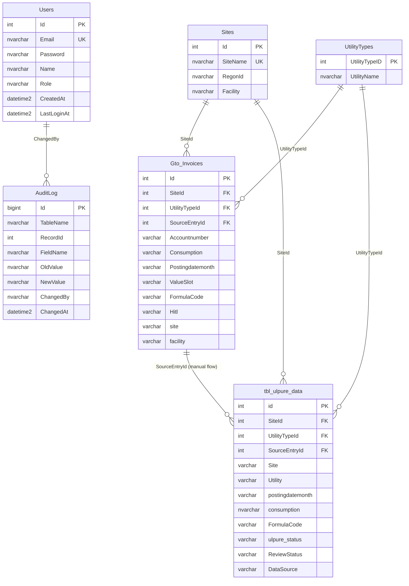
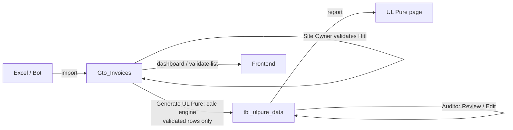

# Database Schema Design — EcoSphere Environmental Reporting

> Database: `ECOSPHERE_DATA_DB` (Azure SQL / SQLite Compatible). This document describes the data
> model the application depends on. Design-first: the schema below is the
> contract every service, controller, and calculation reads from.

---

## 1. Overview

The system tracks **utility invoice/meter data** per site, lets users **validate**
it, and runs a **calculation engine** that produces **UL Pure** ESG indicator
rows for reporting. Six tables carry the whole flow:

| Table | Purpose |
|---|---|
| `Users` | Application login / roles |
| `AuditLog` | Field-level change history |
| `Sites` | Site master + facility grouping |
| `UtilityTypes` | Utility lookup (Electricity, Water, …) |
| `Gto_Invoices` | Raw invoice / meter readings (bot + manual) |
| `tbl_ulpure_data` | Calculated UL Pure indicator rows |

---

## 2. Entity–Relationship diagram

---

## 3. Tables

### 3.1 `Users` — authentication
Columns match the auth code exactly, so login needs no mapping.

| Column | Type | Notes |
|---|---|---|
| `Id` | `INT IDENTITY` PK | |
| `Email` | `NVARCHAR(256)` | unique index (login lookup) |
| `Password` | `NVARCHAR(255)` | bcrypt hash; plaintext auto-upgraded on first login |
| `Name` | `NVARCHAR(100)` | shown in profile / JWT |
| `Role` | `NVARCHAR(50)` | `Admin` \| `SiteOwner` \| `Auditor` |
| `CreatedAt` | `DATETIME2(3)` | default `SYSUTCDATETIME()` |
| `LastLoginAt` | `DATETIME2(3)` | stamped on each successful login |

### 3.2 `AuditLog` — change history
One row per changed field. Read by the History panel.

| Column | Type | Notes |
|---|---|---|
| `Id` | `BIGINT IDENTITY` PK | grows fastest |
| `TableName` | `NVARCHAR(128)` | logical tag (`GtoInvoices` / `UlpureData`) |
| `RecordId` | `INT` | id of the changed row |
| `FieldName` | `NVARCHAR(128)` | |
| `OldValue` / `NewValue` | `NVARCHAR(MAX)` | |
| `ChangedBy` | `NVARCHAR(128)` | |
| `ChangedAt` | `DATETIME2(3)` | default now |

Index: `(TableName, RecordId)` include `ChangedAt`.

### 3.3 `Sites` — site master + grouping
Reference data (edited in-table, not code).

| Column | Type | Notes |
|---|---|---|
| `Id` | `INT IDENTITY` PK | |
| `SiteName` | `NVARCHAR(100)` | unique; the leaf site (`Köping`, `NRV`, `LVLC`, `MEC`, `RT100`, `Macungie`) |
| `RegonId` | `NVARCHAR(50)` | reporting id (now sourced from config, column retained) |
| `Facility` | `NVARCHAR(50)` | **parent group**: `Köping` / `NRV` / `LVO` |

> `LVO` is a **parent grouping only** — never a data site. Its 4 subsites carry `Facility = 'LVO'`.

### 3.4 `UtilityTypes` — utility lookup (pre-existing)
| Column | Type | Notes |
|---|---|---|
| `UtilityTypeID` | `INT` PK | code aliases this as `Id` |
| `UtilityName` | `NVARCHAR` | Electricity, Water, Diesel, … |

### 3.5 `Gto_Invoices` — raw invoice / meter data
The landing table for both the bot and manual entries. Pre-existing columns kept; FK/workflow columns added for the app.

| Column | Type | Group | Notes |
|---|---|---|---|
| `Id` | `INT` PK | key | |
| `Accountnumber` | `varchar` | source | meter/account id |
| `Consumption` | `varchar` | source | numeric text; cast in calc |
| `Invoicedate` | `date` | source | |
| `Postingdatemonth` | `varchar` | source | `YYYY-MM` |
| `Hitl` | `varchar` | **status** | validation status (`Pending` / `Validated` / `Modified and Validated`) |
| `Templatetype` | `varchar` | source | maps to a utility |
| `site` | `varchar` | source | leaf site (Köping/NRV) or `LVO` for US rows |
| `facility` | `varchar` | source | US subsite (LVLC/MEC/…) |
| `units`, `Botstatus`, `Datasource`, `Validateuser`, `Comments`, `validatorLoginTime`, `PdfFile`, `createddate`, `createdtime`, `Formula`, `FreshWaterStaticValue`, `EvaporationFactorValue`, `ConstantValue` | various | source | original bot fields |
| `SiteId` | `INT` FK→`Sites.Id` | **added** | resolved from `site`/`facility` |
| `UtilityTypeId` | `INT` FK→`UtilityTypes` | **added** | resolved from `Templatetype` |
| `ValueSlot` | `NVARCHAR(50)` | **added** | meter slot (`V1`…) for formulas |
| `FormulaCode` | `NVARCHAR(50)` | **added** | calc routing (`DIRECT`, `SITE_FORMULA`, …) |
| `SourceEntryId` | `INT` | **added** | links manual → ulpure |
| `PreviousConsumption` | `FLOAT` | **added** | prior reading |
| `InvoiceNo`, `Approver`, `CreatedBy`, `ModifiedBy` | `NVARCHAR` | **added** | workflow |
| `ModifiedAt` | `DATETIME2(3)` | **added** | edit stamp |

> The old `Status` concept is stored in the existing **`Hitl`** column (no separate `Status` column).

### 3.6 `tbl_ulpure_data` — UL Pure indicator rows
Written by the calculation engine and by manual promotion; read by the UL Pure page.

| Column | Type | Group | Notes |
|---|---|---|---|
| `id` | `INT` PK | key | |
| `postingdatemonth` | `varchar` | data | `YYYY-MM` |
| `utility` | `varchar` | data | |
| `consumption` | `NVARCHAR(50)` | data | text (holds numbers **and** `Yes`/`%`) |
| `ulpure_status` | `varchar` | status | validation state |
| `units`, `site`, `Comments`, `Indicator Name`, `Indicator ID` | various | data | pre-existing |
| `SiteId` | `INT` FK→`Sites` | **added** | calc key |
| `UtilityTypeId` | `INT` FK→`UtilityTypes` | **added** | calc key |
| `SourceEntryId` | `INT` FK→`Gto_Invoices` | **added** | manual-flow link + audit merge |
| `FormulaCode` | `NVARCHAR(50)` | **added** | calc upsert key |
| `DataSource` | `NVARCHAR(50)` | **added** | `Calculated` \| `Manual` (calc ownership) |
| `PreviousConsumptionUL` | `FLOAT` | **added** | |
| `ReviewStatus`, `ReviewedBy` | `NVARCHAR` | **added** | auditor review |
| `ReviewedAt`, `ModifiedAt` | `DATETIME2(3)` | **added** | |
| `ModifiedBy`, `CreatedBy`, `FileName`, `FileUrl`, `EntryNumber`, `EntryName`, `UtilityCode`, `FacilityCode`, `SiteCode`, `Facility`, `AccountMeterNo` | `NVARCHAR` | **added** | workflow / display |

Index: `(SiteId, UtilityTypeId, PostingDateMonth, DataSource)`.

---

## 4. Relationships & keys

| From | Column | To | Meaning |
|---|---|---|---|
| `Gto_Invoices` | `SiteId` | `Sites.Id` | invoice's site |
| `Gto_Invoices` | `UtilityTypeId` | `UtilityTypes.UtilityTypeID` | invoice's utility |
| `tbl_ulpure_data` | `SiteId` | `Sites.Id` | indicator's site |
| `tbl_ulpure_data` | `UtilityTypeId` | `UtilityTypes.UtilityTypeID` | indicator's utility |
| `tbl_ulpure_data` | `SourceEntryId` | `Gto_Invoices.Id` | manual entry origin |
| `AuditLog` | `RecordId` + `TableName` | row in either table | logical (not enforced) |

> FKs are modeled logically in code (application-enforced). Add DB `FOREIGN KEY`
> constraints later if desired.

---

## 5. Key design decisions

1. **Site hierarchy** — `Sites.Facility` groups leaf sites into `Köping` / `NRV` / `LVO`. `LVO` is display/grouping only; invoices resolve to a leaf `SiteId`.
2. **Validation status lives in `Hitl`** — the existing column is reused instead of adding a duplicate `Status`.
3. **`DataSource` is a safety flag** — the calc engine only updates/prunes rows it owns (`Calculated`), never touching `Manual`/legacy rows.
4. **`FormulaCode` is part of the calc upsert key** — allows multiple indicators per site/utility/month without collisions.
5. **`RegonId` is config, not code-hardcoded** — editable reference data (`Sites.RegonId` + `regonIds.js`).
6. **Text columns for mixed values** — `consumption` is `NVARCHAR` because some indicators are `Yes`/`%`, not numbers.

---

## 6. End-to-end data flow

- **Köping** = meter formulas (needs 2 validated months for delta indicators).
- **US subsites (LVO)** = pass-through per meter slot.
- **NRV** = aggregate mode (SUM of validated rows by `Templatetype`).
- Only **validated** (`Validated` / `Modified and Validated`) rows feed the calc.
